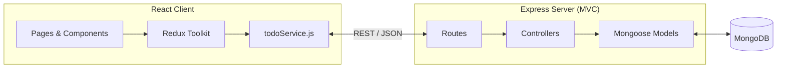
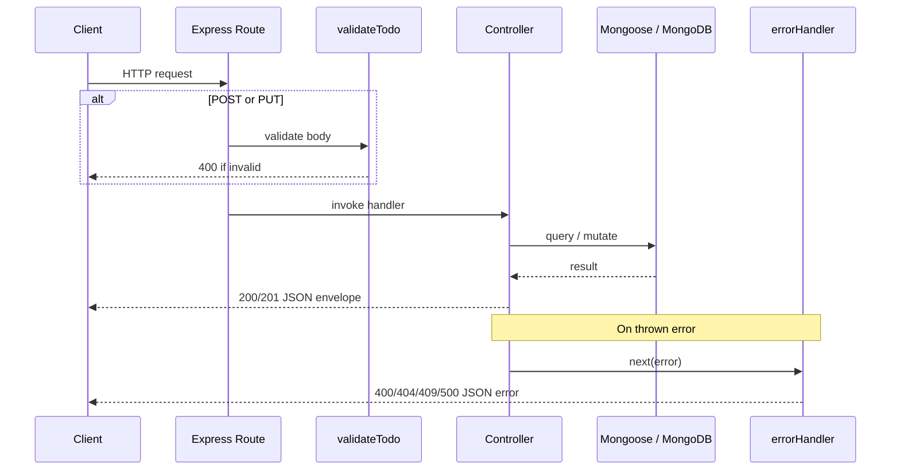
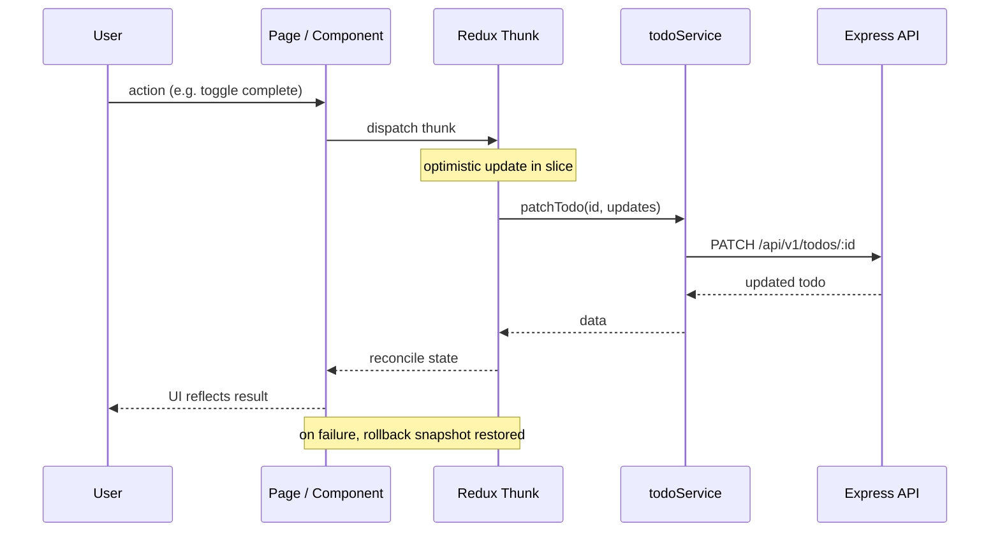
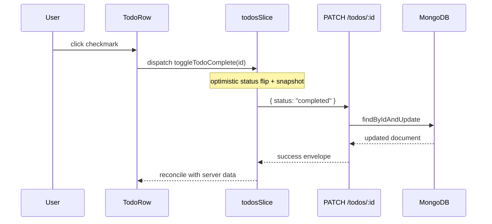

# Architecture Overview

## High-Level Overview

Tasklin is a two-tier application: a React client talks to an Express REST API, which persists data in MongoDB via Mongoose.



- The **client** uses React Router for navigation across four routes: task list, task detail, create form, and edit form.
- The **server** is a Node.js/Express REST API following an **MVC** pattern.
- **MongoDB** (via Mongoose) is the persistence layer.

---

## Backend Architecture (MVC)

```
server/src/
├── models/         # M — data shape & schema (Mongoose)
├── controllers/    # C — request handling & business logic
├── routes/         # maps HTTP routes to controller functions
├── middlewares/    # validation & centralized error handling
├── config/         # db connection, seed script
├── app.js          # Express app setup (middleware, routes mounted)
└── server.js       # entry point — connects to DB, starts server
```

### Model

`models/todo.model.js` defines the Mongoose schema for a Todo:

| Field | Type | Notes |
|---|---|---|
| `title` | String | Required |
| `description` | String | Optional |
| `status` | String | `pending` or `completed`; default `pending` |
| `priority` | String | `low`, `medium`, or `high`; default `medium` |
| `dueDate` | Date | Optional |
| `tags` | `[String]` | Optional array of tag strings |
| `createdAt` / `updatedAt` | Date | Automatic timestamps |

### Controller

`controllers/todo.controller.js` implements CRUD logic:

- **GET /todos** — builds a Mongoose filter from query params (`status`, `priority`, `tag`, `search`), applies sort (comma-separated fields; `-` prefix for descending), and paginates results (default limit 10, max 100).
- **GET /todos/:id** — fetches a single document; validates ObjectId format.
- **POST /todos** — creates a new document.
- **PUT /todos/:id** — full replacement update.
- **PATCH /todos/:id** — partial update (e.g. toggling `status`).
- **DELETE /todos/:id** — removes a document.

All responses use a consistent `{ success, data, message }` envelope.

### Routes

`routes/todo.routes.js` maps REST endpoints to controller functions and is mounted at `/api/v1/todos` in `app.js`. A separate `routes/health.js` handles `GET /api/v1/health`.

### Middlewares

- `validateTodo.js` — validates request bodies on `POST` and `PUT` (title required, enum checks for status/priority, date and tags validation).
- `errorHandler.js` — centralized error handler for Mongoose validation errors, cast errors (invalid ObjectId), duplicate key errors, and generic server errors.

### Config

- `db.js` — connects to MongoDB using `MONGODB_URI`.
- `seed.js` — one-off script that clears and repopulates the database with seven sample todos.

### Backend Request Lifecycle



1. Request hits an Express route (e.g. `POST /api/v1/todos`).
2. `validateTodo` middleware checks the body on create/full-update requests.
3. The controller runs, using the `Todo` model to read or write MongoDB.
4. The controller returns a response in the standard envelope.
5. Errors are caught by `errorHandler` and returned as clean JSON.

---

## Frontend Architecture

```
client/src/
├── pages/
│   ├── TodoListPage.jsx       # / — list, filters, bulk actions
│   ├── TodoDetailPage.jsx     # /todos/:id — inline editing
│   └── TodoFormPage.jsx       # /todos/new, /todos/:id/edit
├── components/
│   ├── Layout.jsx             # header + outlet
│   ├── todos/                 # TodoRow, TodoList, filters, pagination, etc.
│   └── ui/                    # shadcn-style Dialog primitive
├── features/todos/
│   └── todosSlice.js          # Redux slice + async thunks
├── app/
│   └── store.js               # Redux store
├── services/
│   └── todoService.js         # fetch wrapper for all API calls
├── context/
│   └── ToastContext.jsx       # toasts + inline confirm dialogs
├── hooks/
│   └── useDebounce.js
├── lib/validations/
│   └── todoSchema.js          # Zod schema + payload builders
├── utils/
│   ├── listQueryParams.js     # URL ↔ filter sync
│   └── todoHelpers.js         # grouping, formatting, styling helpers
└── App.jsx                    # route definitions
```

### Routing

`App.jsx` defines routes wrapped in a shared `Layout`:

| Path | Page | Purpose |
|---|---|---|
| `/` | `TodoListPage` | Task list with search, filters, pagination |
| `/todos/new` | `TodoFormPage` (create) | Full-page create form |
| `/todos/:id` | `TodoDetailPage` | Detail view with inline editing |
| `/todos/:id/edit` | `TodoFormPage` (edit) | Full-page edit form |

Navigation between list, detail, and form pages carries filter state via URL query parameters (`status`, `priority`, `tag`, `search`, `sort`, `page`, `limit`).

### State Management (Redux Toolkit)

`todosSlice.js` holds:

- `todos` — current page of results
- `currentTodo` — single todo loaded on detail/form pages
- `pagination` — `{ total, page, limit, pages }`
- `filters` — search, status, priority, tag, sort, page, limit
- `listLoading` / `actionLoading` / `error`
- `rollbackSnapshots` — for optimistic update rollback

Async thunks (`fetchTodos`, `createTodo`, `updateTodo`, `patchTodo`, `deleteTodo`, `toggleTodoComplete`, `bulkCompleteTodos`, `bulkDeleteTodos`) call `todoService.js` and update state on success or failure.

### Service Layer

`todoService.js` is the single HTTP layer. It reads `VITE_API_BASE_URL` (default `/api/v1`), builds query strings, parses the API envelope, and throws on error. Components and thunks never call `fetch` directly.

### Forms & Validation

- **Create / edit pages** — `TodoFormPage` uses React Hook Form with a Zod resolver (`todoFormSchema`).
- **Detail page** — inline fields (`InlineEditableField`) validate with the same Zod schema before saving via `PUT`.

### Notifications & Confirmations

`ToastContext` provides success/error toasts and inline confirm dialogs (used for delete confirmations on the list and detail pages).

### Frontend Data Flow



1. User performs an action (e.g. toggles complete on a row).
2. The slice applies an optimistic update immediately.
3. The thunk calls `todoService`, which sends the HTTP request.
4. On success, state is reconciled with the server response.
5. On failure, the snapshot is restored and an error toast is shown.

---

## End-to-End Example: Marking a Todo Complete



1. User clicks the checkmark on a todo row in `TodoListPage`.
2. `toggleTodoComplete` saves a rollback snapshot and flips status optimistically.
3. A `PATCH /api/v1/todos/:id` request sends `{ status: "completed" }`.
4. `todo.controller.js` updates the document via Mongoose.
5. MongoDB persists the change; the controller returns the updated todo.
6. The thunk resolves and reconciles Redux state (or rolls back on failure).

---

## URL ↔ Filter Sync

List page filters live in two places that stay in sync:

1. **Redux** (`filters` in `todosSlice`) — drives API requests.
2. **URL search params** — enables shareable/bookmarkable list views and preserves state when navigating to detail or form pages and back.

`listQueryParams.js` converts between URL params and the Redux filter shape. Detail and form pages append the current query string to their back links so the list view is restored on return.
